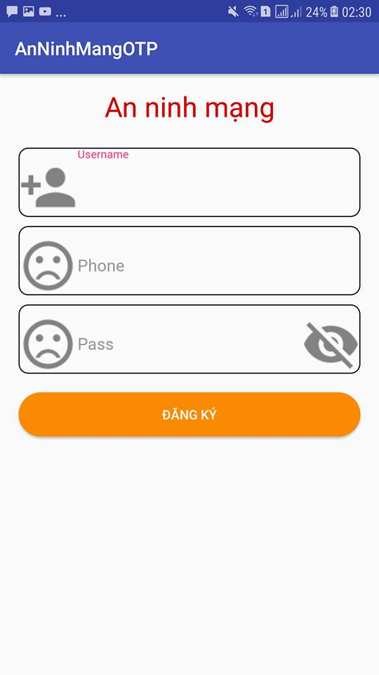
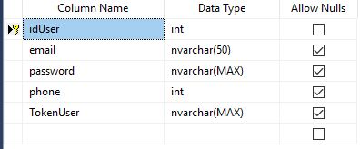
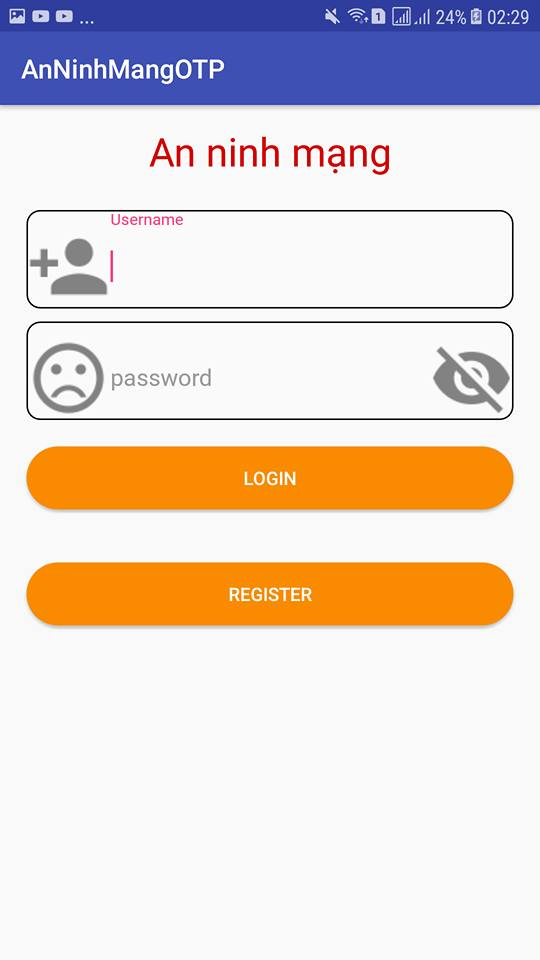
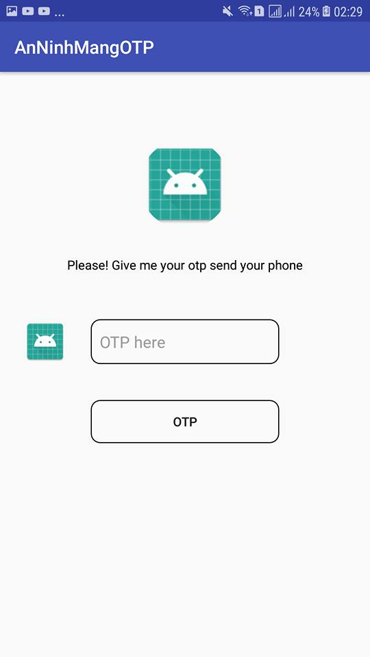

Tạo cơ sở dữ liệu SQL-Server connect to project OTP by LINQ

CREATE TABLE [dbo].[User] (

[idUser] INT IDENTITY (1, 1) NOT NULL,

[email] NVARCHAR (50) NULL,

[password] NVARCHAR (MAX) NULL,

[phone] INT NULL,

[TokenUser] NVARCHAR (MAX) NULL,

CONSTRAINT [PK_User] PRIMARY KEY CLUSTERED ([idUser] ASC)

);

**Tổng quan về ứng dụng**
=========================

>   \- Chương trình demo gồm các tác vụ đăng ký, đăng nhập xác thực bước 2 OTP

>   \- Xây dựng theo mô hình client-server

>   \- Sử dụng IIS(Internet Information Services ) xây dựng server chạy trên nền
>   window được viết bằng restful api c\#

>   \- Sử dựng hệ quản trị cơ sở dữ liệu SQL Server để lưu dữ liệu user

>   \- Client là các ứng dụng sử dụng trên nền tảng Android viết bằng ngôn ngữ
>   java

>   \- Sử dụng api của speedsms.vn để gửi tín nhắn otp đến user

**Phân tích ứng dụng**
======================

-   **Đăng ký**

Hình 4.1: Đăng ký tại client (App)

Bước 1: Sau khi người dùng điền đẩy đủ thông tin và ấn nút đăng ký thì client
(ứng dụng) yêu cầu với Server đăng ký thông tin.

Bước 2: Server sẽ kiểm tra thông tin người dùng đã yêu cầu với cơ sở dữ liệu và
trả về kết quả thành công hay thất bại.

Bước 3: Nếu thành công sẽ lưu các thông tin sau vào cơ sở dữ liệu.

-   Username

-   Số điện thoại user

-   Password

-   TokenUser(Định danh cho mỗi user)

Hình 4.2: Cở sở dữ liệu

>   \- Cách thức bảo mật password người dùng và sinh Token User

-   Bảo mật password trong cơ sở dữ liệu: Sử dụng thuật toán mã hóa HMACSHA256
    với một khóa bí mật:

>   **hash_hmac("SHA256", “Password", "secret key")**

-   Cách tạo ra Token User: Token User đóng vai trò là SeekCode trong thuật toán
    sinh TOTP để sinh OTP.

    **hash_hmac("SHA256", “Email+ Password +**

    **số ngẫu nhiên 6 chữ số", "secret key")**

-   **Đăng nhập**

Hình 4.3: Đăng nhập tại client

Bước 1: Sau khi người dùng điền đẩy đủ thông tin sẽ yêu cầu với Server đăng
nhập.

Bước 2: Server kiểm tra thông tin user trong cơ sở dữ liệu và trả về kết quả cho
client bao gồm thông tin của User như email, phone, Token User.

Bước 3: Sau khi Server trả về kết quả ở bước 2. Client sẽ thực hiện yêu cầu lên
sever với tham số truyền lên là Token User, yêu cầu send SMS OTP đến số điện
thoại người dùng để xác thực bước đăng nhập bước 2.

Hình 4.4: Bước xác thực OTP sau khi Login thành công

Bước 4: Server kiểm tra TokenUser của user nếu hợp lệ thì tạo mã OTP theo TOTP
và đồng thời gửi mã OTP về số điện thoại của người dùng và mã hóa OTP theo thuật
toán HMACSHA256 với một khóa bí mật giữa client và Server và trả về chuỗi mã hóa
đó cho client.

Bước 5: Sau khi nhận được OTP từ sms . Người dùng sẽ nhập mã OTP đó vào ô nhập
OTP. Tại Client sẽ thực hiện mã hóa OTP mà người dùng nhập vào theo thuật toán
HMACSHA256 với khóa bí mật giữa client và Server và so sánh kết quả trả về từ
server. Nếu trùng khớp thì xác thực OTP thành công.
